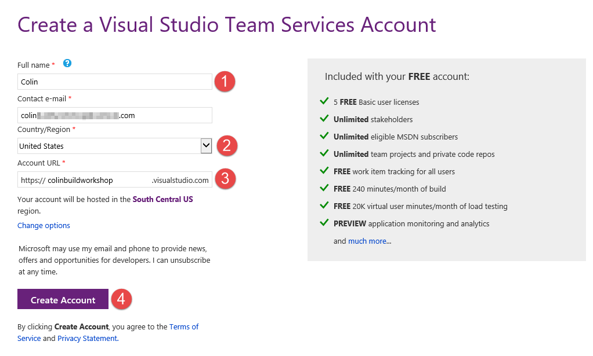
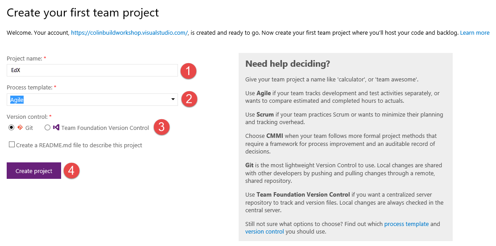

# EdX DEV212x Intro to DevOps - LAB 1 #
This is the Hands on Lab for module 1 of the Introduction to DevOps course.

## LAB 1 - Setting up a Visual Studio Team Services Account ##

### Prerequisites ###
You will need the following in order to complete the hands on labs:

- Visual Studio 2015 Community (or higher) 
- a Visual Studio Team Services (VSTS) account

#### Visual Studio Community ####
If you do not have Visual Studio 2015 Professional or Enterprise editions, then you can download and
install [Visual Studio 2015 Community](https://www.visualstudio.com/en-us/products/visual-studio-community-vs.aspx) for free.

#### Create a Visual Studio Team Services (VSTS) Account) ####
> **Note**: If you already have a VSTS account, you can skip this step. However, you need to ensure that it is an account in which you are the account owner. In other words, if you create the account yourself, you can skip this step and just sign into your account. However, if some else created the account and added you to the account, then you will need to complete this step. Once you have signed into your existing account, then create a new Team Project as specified in [Task 2](#Ex4Task2).

1. Sign into [visualstudio.com](https://go.microsoft.com/fwlink/?LinkId=307137).

    Enter your Microsoft Account credentials.

    

    _Signing into visualstudio.com_

    > **Note**: If you do not have a Microsoft Account, then you will need to create one by clicking "Sign up now". Once you have created an account, you can sign in using that account.

1. Create a new VSTS account by entering the following information:

    - Your name
    - Your region
    - The name of your new account
    - Click **Create Account**

    

    _Creating a New VSTS Account_

    > **Note**: You can change your email address and region if you want to.    

1. Once the account is created, you will see the VSTS landing page, which will prompt you to create a new Team Project. Continue to the next task.
    
    Enter the following information:
    - A project name - we recommend that you call the project _EdX_
    - Select the **Agile** process template
    - Select **Git** version control
    - Click **Create project** button

    

    _Creating a New Team Project_

    > **Note**: The project template defines what work item types and workflows are available. The Hands-on-labs can be completed with any of the three
    templates, but Agile is a good all-round template.

1. Once the Team Project is created, you will be redirected to the Team Project dashboard. You can close the Congratulations dialog once you have read it.

    

    _The Team Project Dashboard_
