# EdX DEV212x Intro to DevOps - LAB 4 #
This is the Hands on Lab for module 4 of the Intro to DevOps course.

> **NOTE:** VSTS is a rapidly evolving service, with releases coming every 3 weeks. Some of the images and instructions in this lab may change slightly so that they look different when you go through this lab. If you take a deep breath and think of the goal you're trying to achieve, you should be able to work out where to go even if the user interface does not exactly match the LAB.

## LAB 4 - Release Management with Visual Studio Team Services ##
Once you have completed the videos and other course material for Module 4, you can continue with this lab.

In this lab you have an application called PartsUnlimited, committed to a Git repo
in Visual Studio Team Services (VSTS) and a Continuous Integration build that builds the app and
runs unit tests whenever code is pushed to the master branch. Please refer to the
[LAB 3](../Lab3/EdX212x-Lab3.md) in order to see how the CI build was set up.
Now you want to set up Release Management (a feature of Visual Studio Team Services)
to be able continuously deploy the application to an Azure Web App. Azure Web Apps allow you to specify
deployment slots - these can be used with Traffic Manager to perform A/B testing. Deployment slots
are also commonly used for _hot swapping_. This allows you to deploy new code to a slot, test it and then
hot swap it so that your site is never down. For the puroposes of this lab, we will use the slots to isolate
changes being introduced into the environment for testing purposes. Initially the
app will be deployed to a `dev` deployment slot. The `staging` slot will require an
approver before the app is deployed into it. Once another approval is done on the `staging` slot,
the app will be deployed to the production site.

## Pre-requisites:

* You have completed [LAB 1](../Lab3/edX-DEV212x-Lab1.md)
* You have completed [LAB 3](../Lab3/edX-DEV212x-Lab3.md)

* An active Azure account to host the PartsUnlimited Website as a Web App
> **Note**: In order to use deployment slots, you'll need to configure the Web App to use Standard or Premium App Service Plan mode. You **cannot** create
deployment slots for Basic or Free Azure Web Apps. To learn more about deployment slots, see [this article](https://azure.microsoft.com/en-us/documentation/articles/web-sites-staged-publishing/).

## Tasks Overview:

**1. Complete [LAB 3](../Lab3/edX-DEV212x-Lab3.md).**
This will walk through creating a Visual Studio Team Services account, committing the PartsUnlimited source code
and setting up the Continuous Integration (CI) build.

**2. Create a Service Endpoint in Visual Studio Team Services to an Azure Account.**
In this step you'll download your Azure publish settings file and create Service Endpoint in Visual Studio Team Services for
your Azure account. This will enable you to configure deployment of the PartsUnlimited Website to Azure as an Azure
Web Application from Builds or Releases.

**3. Create a Release Pipeline for the Parts Unlimited Website.**
In this step, you will create a Release definition for the PartsUnlimited Website. You'll use the CI build output
as the input artefact for the Release and then define how the release moves through `environments` with approvals
in between.

**4. Trigger a Release.**
Once the Release Definition is set up, you will trigger a release and see the pipeline in action.

# Hands On Lab
### 1: Complete HOL - Parts Unlimited Website Continuous Integration with Visual Studio Team Services
Make sure you've completed [LAB 3](../Lab3/edX-DEV212x-Lab3.md).

### 2: Create a Service Link from Visual Studio Team Services to an Azure Account
In order to interact with Azure, you'll need to create a Service Endpoint in VSTS. This Endpoint includes the
authentication information required to deploy to Azure.

> **Note**: Deploying [ARM Templates](https://azure.microsoft.com/en-us/documentation/articles/resource-group-authoring-templates/)
to Azure from Release Management requires a [Service Principal](http://blogs.msdn.com/b/visualstudioalm/archive/2015/10/04/automating-azure-resource-group-deployment-using-a-service-principal-in-visual-studio-online-build-release-management.aspx).

When you create a new Service Endpoint in VSTS, a wizard pops up. The wizard has two "modes": automatic or manual. This lab will walk through the manual method - however, you should first attempt the **automatic** method.
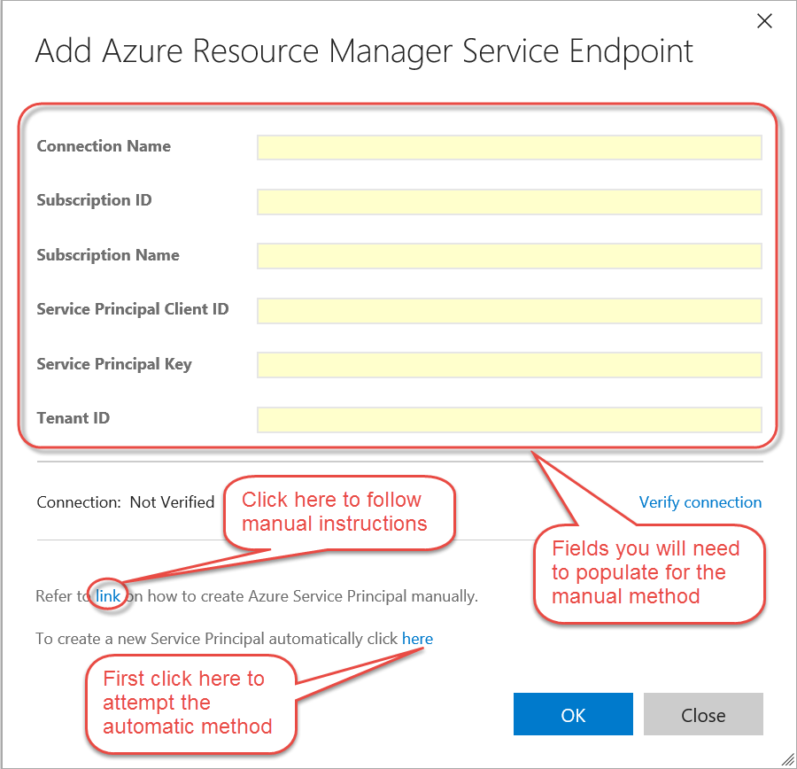

- **PowerShell Script** if you do not see any subscriptions, then you will have to click on the [link](https://www.visualstudio.com/en-us/docs/release/author-release-definition/understanding-tasks#azure-resource-manager-service-endpoint) provided in the dialog and follow the instructions. The link will have a PowerShell script that you will download. The script will output several pieces of information which you will fill in on corresponding fields in the wizard.

1. Create an Azure Service Endpoint in Visual Studio Team Services
	* Log in to your VSTS account.
	* Open the project administration page by clicking the gear icon in the upper right.
	
		
	* Click on the Services tab
	
		
	* Click on "New Service Endpoint" and select "Azure Resource Manager" from the list

	* First attempt to click the link for creating the connection automatically.
	> **Note**: Automatic only works if you are signed into VSTS using an account that is linked to an Azure subscription in the Azure Portal. The wizard will prompt you to select the Azure Susbscription and then automatically create the Service Principal. If this works, skip to the next task.
	
	* If you do not see any subscriptions listed in the Automatic dialog, then click on the link to create the Service Principal manually. Download the PowerShell script and run it. When the script completes, it will give you values for all the fields in the Wizard.

		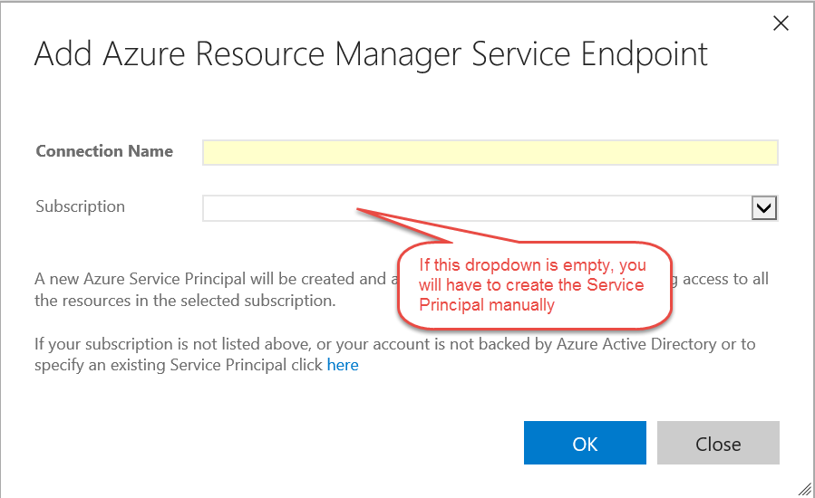
	
	* When you have filled in the fields, click "Verify connection" to verify the connection. Click OK to close the dialog.
	
		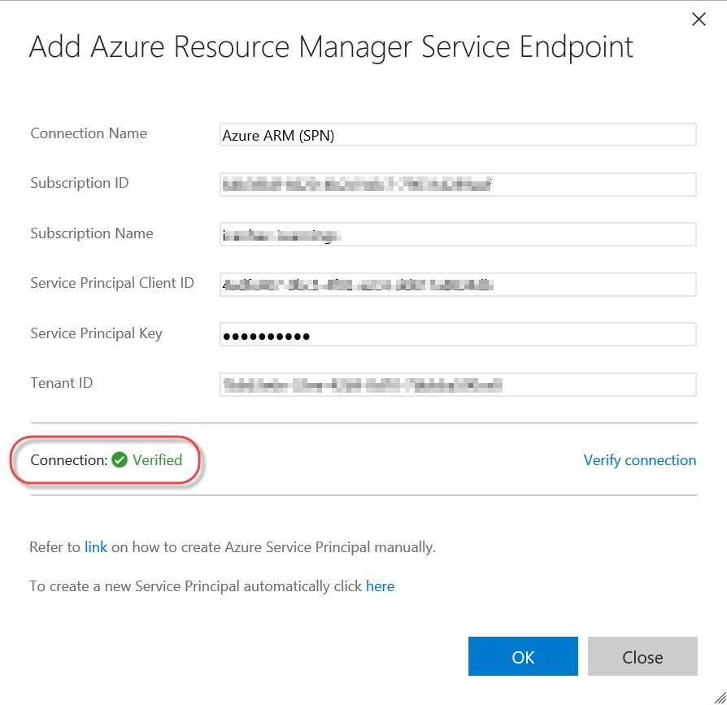
	* You should see a new Service Endpoint in the list of endpoints on the left of the Endpoints page. You can close the project administration page.

		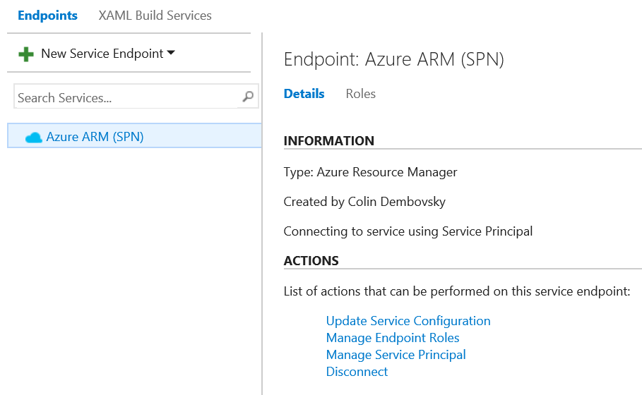
	
### 3: Create a Release Definition
Now that you have an Azure Service Endpoint to deploy to, and a package to deploy (the output from your build),
you can create a Release Definition. The Release Definition defines how your application moves through
various Environments, including Tasks to update infrastructure, deploy your application, run scripts and
run tests. You can also configure incoming (pre) or outgoing (post) approvals for each Environment.

An Environment is simply a logical grouping of tasks - it may or may not correspond to a set of machines.
For this Release Definition, you will create three environments: Dev, Staging and Production.

The infrastructure required for all three environments is described in an ARM Template. The ARM Template will
be invoked during the deployment in the Dev Environment before deploying the website to Dev. It will not
be necessary to run any infrastructure tasks during Staging or Production deployments in this case. 

1. Create a Release Definition to Deploy Infrastructure and Deploy to Dev
	* In VSTS, click on the Release hub
	* If you have no release definitions yet, you will be prompted to create one. Otherwise, click on the green + button at the top of the left hand menu to create a new definition. This will
	launch a wizard prompting you to select a deployment template.

		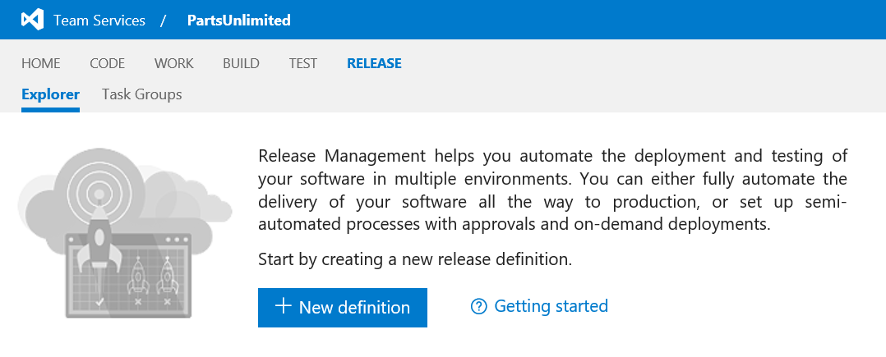
	
	Click on "Empty" to start with an empty	release and click OK.

	* Select the PartsUnlimited Build that you created in Lab 3. Enable "Continuous Deployment" to queue a release whenever a new successful build is available. Ensure that the "Hosted" queue is selected in the Queue settings:

	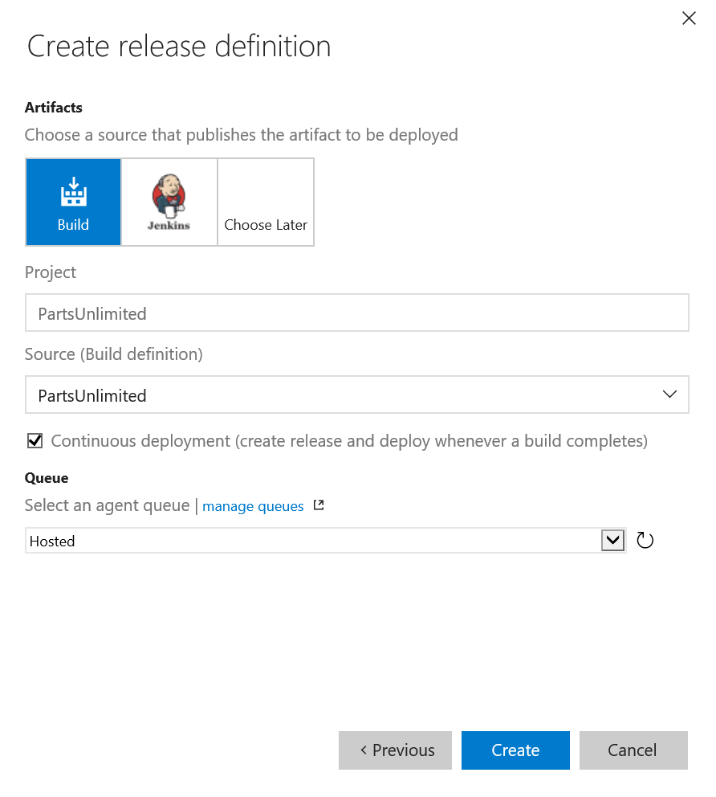
	
	* Click "Create"
	* The template has created a single Environment (called Environment 1).
	* Click the pencil icon next to the name and rename this Release Definition to "PartsUnlimited".

	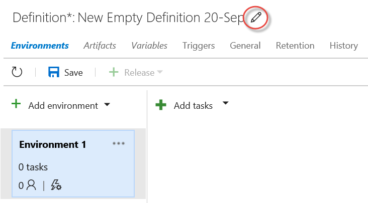

	* Click the Save button to make sure that you can save the Release Definition. You do not have to enter comments when saving.

	* Click the name label on the the first environment card and change the name to "Dev".
	
		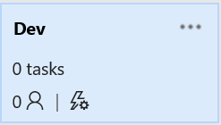
	
	* Click on the "+ Add tasks" button to add a task for this environment. If you are presented with the following dropdown, then cancel and click the button again, since we do not need "containers" for this release.
		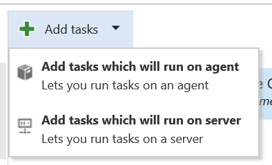	
		
		> **Note**: It is possible to create "containers" of tasks - some that run on agent and some that run on the server. At present, the only "server" task that exists is the Manual Intervention task. All other tasks are "agent" tasks.

		In the "Deploy" group, click the "Add" button next to "Azure Resource Group Deployment" to add the task. Close the "ADD TASKS" dialog.
	
		
		
	* Click on the "Azure Resource Group Deployment" task. Configure it as follows:
		* `Azure Connection Type`: select "Azure Resource Manager"
		* `Azure RM Subscription`: select the Azure endpoint that you created in Task 2
		* `Action`: select "Create or Update Resource Group"
		* `Resource Group`: select an existing name (if any) or enter a name for your resource group. This must be unique in your Azure
		subscription.
		* `Location`: select an Azure geographic location
		* `Template`: click the "..." button and browse to the FullEnvironmentSetupMerged.json file in the ARMTemplates
		folder.
		
		
		* `Template Parameters`: click the "..." button and browse to the FullEnvironmentSetupMerged.param.json file
		in the ARMTemplates folder.
		* `Override Template Parameters`: Enter the following in a single line (shown split here for convenience):
		```powershell
		-WebsiteName $(WebsiteName) 
		-PartsUnlimitedServerName $(ServerName)  
		-PartsUnlimitedHostingPlanName $(HostingPlan) 
		-CdnStorageAccountName $(StorageAccountName) 
		-CdnStorageContainerName $(ContainerName) 
		-CdnStorageAccountNameForDev $(StorageAccountName)-dev 
		-CdnStorageContainerNameForDev $(ContainerName)-dev
		-CdnStorageAccountNameForStaging $(StorageAccountName)-stage 
		-CdnStorageContainerNameForStaging $(ContainerName)-stage 
		-PartsUnlimitedServerAdminLoginPassword (ConvertTo-SecureString '$(AdminPassword)' -AsPlainText -Force) 
		-PartsUnlimitedServerAdminLoginPasswordForTest (ConvertTo-SecureString '$(AdminTestPassword)' -AsPlainText -Force)
		```
				
		> **Note**: If you open the FullEnvironmentSetupMerged.param.json file, you will see empty placeholders for these parameters.
		> You could hard code values in the file instead of specifying them as "overrides". Either way is valid. If you do specify
		> values in the params file, remember that in order to change values, you would have to edit the file, commit and create a 
		> new build in order for the Release to have access the new values.
		
		* `Enable Deployment Prerequisites`: Leave this unchecked - this enables WinRM for Virtual Machines. The template we are deploying does not have virtual machines, so we leave this setting unchecked.
		You will shortly define the values for each parameter, like `$(ServerName)`, in the Environment variables.
		* Make sure the `Output -> Resource Group` parameter is empty. It is not required for this release.
		* Your configuration should look something like the following:
		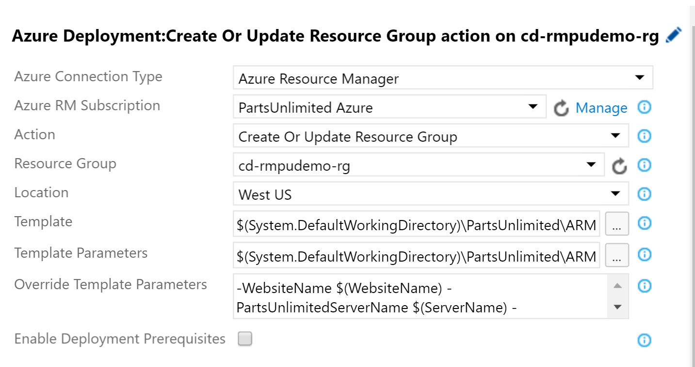
		
	* Click on the ellipsis (...) button next to the Environment and select "Configure variables..."

		

	* Create the following variables, adding values too.
		* **WebsiteName** - Name of the website in Azure (this must be globally unique)
		* **ServerName** - Prefix for the name of the database servers. Will have `-dev` or `-stage` added for dev/staging
		* **HostingPlan** - Name of the hosting plan for the website
		* **StorageAccountName** - Storage account name prefix. Will have `-dev` or `-stage` added for dev/staging. (Be careful with naming storage accounts, they must be all lower case, alphanumeric only, between 3 and 24 characters, and globally unique.)
		* **ContainerName** - Container name prefix. Will have `-dev` or `-stage` added for dev/staging
		* **AdminPassword** - Admin password for production database server
		* **AdminTestPassword** - Admin password for dev and staging database servers

		
		> **Note**: You can hide passwords and other sensitive fields by clicking the padlock icon to the right of the value text box.

		* Save the definition.

1. Test the ARM Template Deployment

	Before moving on, it is a good idea to test the template so far.
	
	* Click on "+ Release" in the toolbar and select "Create Release" to start a new release.

	
	
	* Select the latest build from the drop-down. You will see that deployment to the "Dev" environment is set to automatic, meaning that it will run the tasks for the "Dev" environment immediately after creating the release.
	Click "Create" to start the release.

	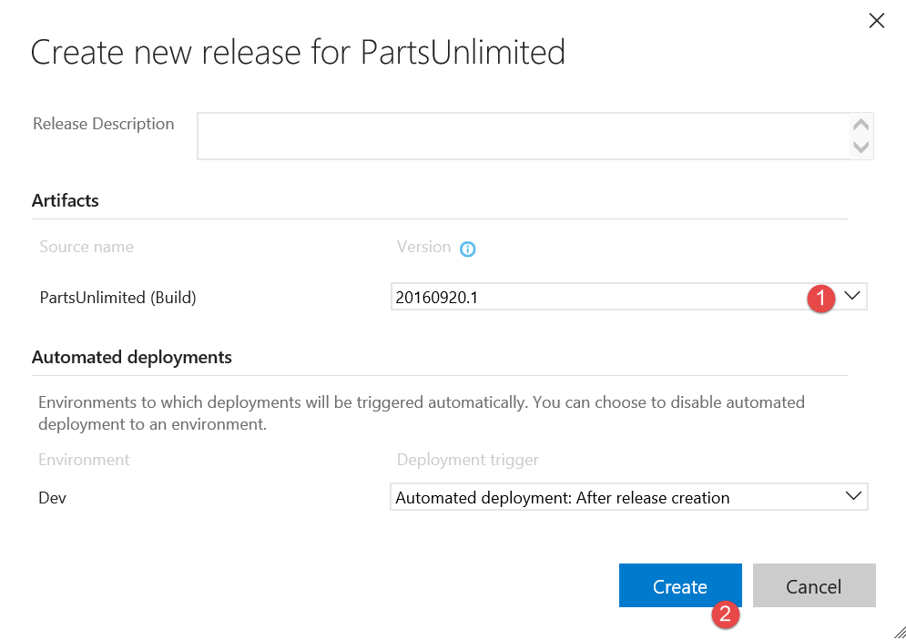
	
	* Click the "Release-x" link to open the release.

	
	
	* Click on the Logs link to open and monitor the deployment logs.
	
	* You should see a successful release after a few minutes.

	
	* If you log into the Azure Portal, you will see the Resource Group has been created. By drilling into the Resources, you can see all of the resources automatically created by executing this task.

	
	
	> NOTE: You can run this task repeatedly, since it is _idempotent_. Additionally, updates to the underlying template will modify an already deployed Resource Group.
	
1. Add Web Deployment Tasks to Deploy the Web App

	Now that the infrastructure deployment is configured, you can add a task to deploy the web app to Dev.
		
	* Click on the Dev environtment in the Release Definition. Then click "+ Add tasks".
	* Select the "Deploy" group in the left and click the add button next to "Azure App Service Deploy" to add the task.
Close the task selector dialog.
	* Click on the "Azure App Service Deploy" Task. And configure according to the steps below.
		* `AzureRM Subscription`: select the AzureRM Service Endpoint you created earlier
		* `Web App Name`: enter `$(WebsiteName)` to use a variable. You defined this variable earlier when deploying
		* Check the `Deploy to Slot` checkbox to open settings for the deployment slot
		* `Resource Group`: Select (or enter) the same resource group that you entered in the Azure Deployment task
		* `Slot`: enter "dev". This will deploy the site to the "dev" deployment slot. This allows you
		to deploy the site to an Azure deployment slot without affecting the Production site.
		* `Package`: click the ellipsis (...) button and browse to the PartsUnlimitedWebsite.zip file and click OK.
	
		
		* The Task should look like this:
	
		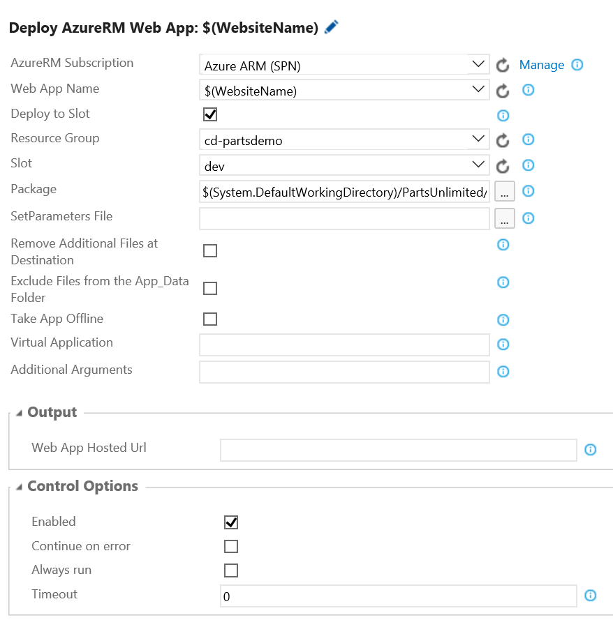
	> **Note**: It is a good practice to run smoke tests to validate the website after deployment, or to run load tests. The code-base you are using
	does not have any such tests defined. You can also add a task to run quick cloud-performance tests to validate that the site is up and running. For more 
	information on quick load tests, see [this video](https://channel9.msdn.com/Events/Visual-Studio/Connect-event-2015/Cloud-Loading-Testing-in-Visual-Studio-Team-Service)
	from around the 6 minute mark. 
	
	* Promote the WebSite Environment variable to a Release Variable so it can be used across multiple environments.
		* Click on the "Dev" environment, click the ellipsis (...) button select "Configure Variables".
		* Make a note of the `WebsiteName` variable value and delete it from this list. Click OK.
		* Click on "Configuration" to open the Release variables. These are "global" variables that any Environment can use.
		* Enter "WebsiteName" for the name and enter the value for the Website in Azure.

		
		
	* Click Save to save the Release Definition.

1. Test the Dev Environment

	You will shortly clone the Dev Environment into both Staging and Prod environments. However, before you do that
	it's a good idea to test that the Dev Environment is correctly configured by creating a new Release.

	* Click on the "+ Release" button and select Create Release.
	
	
	* You can enter a Release Description if you want to.
	* Select the latest build from the HOL Build drop down.
	* If necessary, click on the Dev Environment to set it as the target environment for this Release. 
	* Click Create.
	* Click the Release link to open the Release.
	
	
	* Click on the Logs link to open the deployment logs.
	* Once the deployment completes, you can check that the site was in fact deployed successfully by navigating to the
	site url.
	> Since you deployed to the dev slot, you will need to navigate to `http://{siteName}-dev.azurewebsites.net` where siteName 
	is the name of your Web App in Azure.
	
	
	* You will also have received an email confirmation that the Release to the Dev environment completed successfully. This
	is because you are the owner of the Dev environment.
		
1. Clone the Dev environment to Staging and Production

	Now that you have verified that the Dev Environment is configured correctly, you can clone it to Staging and Production.
	
	* Click on the PartsUnlimited link and then the Edit link to open the Release Definition.
	> **Note:** It is possible to change the definition for a Release without changing the Release Definition (i.e. the Release is an instance of the Release Definition that you can edit). You want to make sure that you are editing the Release Definition, not a Release.
	
	* Click the ellipsis (...) on the Dev Environment card and select "Clone environment".
	
	
	* Leave the dialog with the default values. You will assign approvers for the Staging environment shortly. You also want the trigger for the Staging environment to be a successful deployment to Dev (the default trigger).
	* A new Environment (called "Copy of Dev") appears. Rename the Environment to "Staging".
	* Delete the "Azure Resource Group Deployment" task. This is not required in this Environment since the ARM template deployed
	the infrastructure for all 3 environments.
	* Click the ellipsis (...) on the Staging Environment card and select "Configure variables".
	* Delete all the variables. These are used by the "Azure Resource Group Deployment" task which you just deleted, so they are not
	necessary in this Environment.
	* On the Azure Web App Deployment task, set the Slot to `staging`.
	
	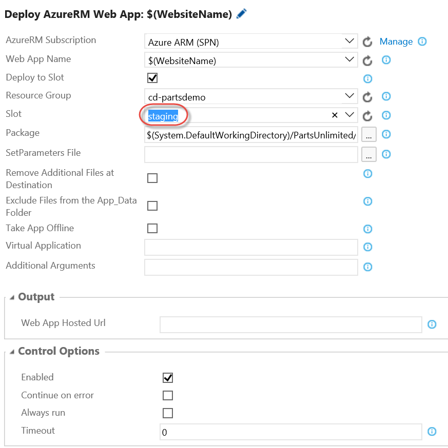
	
	> **Note**: If you had environment-specific variables, you would be able to set Staging-specific values. It is not necessary in this case.
	
	* In the Dev Environment, you did not define any approvers. For Staging, however, you should
	configure approvers. For this HOL, you can be both incoming and the outgoing approver.
	> **Pre-deployment approvers** must approve a deployment coming _into_ the environment. The deployment will stop and wait
	before executing any tasks in the environment until approval is granted.<br/>
	**Post-deployment approvers** approve deployments so that the _next_ Environment can begin. They act as sign-off
	for the current environment.<br/>
	**Approvers** can be individuals or groups.
	
	* In this case, you want to pause the deployment coming into Staging. This ensures that if someone is testing in the Staging environment,
	they don't suddenly get a new build unexpectedly.
	* Configure approvers and notifications for the Staging environment.
	
	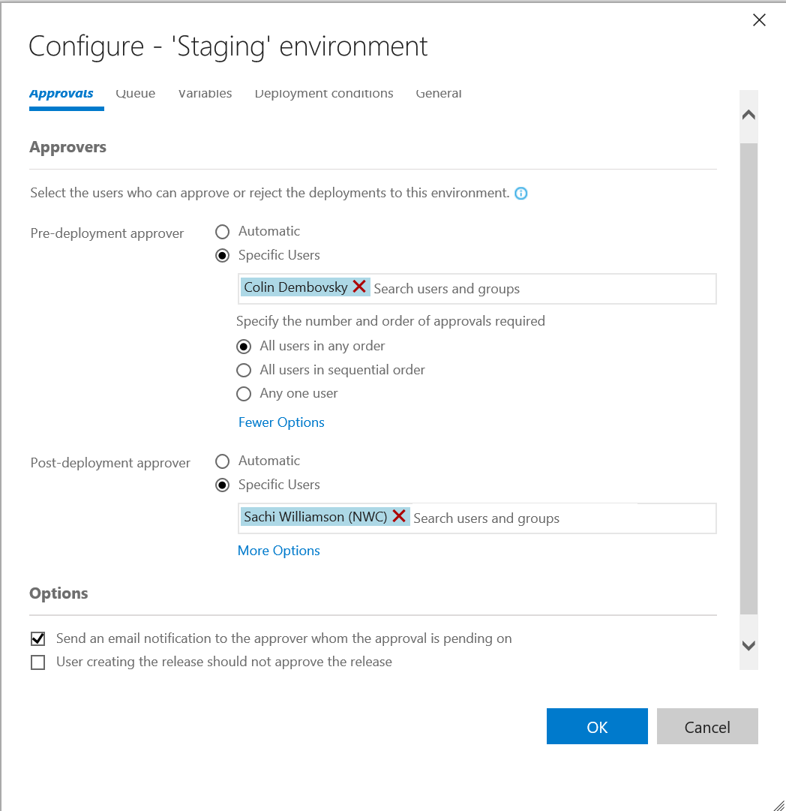

	> **Note**: Clicking "More Options" on the pre- or post-approval sections allows you to define approval rules for the list of users.
	
	* Save the Release Definition.

	* Clone the Staging environment to Production.
		* Uncheck the "Deploy to Slot" setting. If no slot is specified, the web app will be deployed to the production slot.
		* Update the approvers - again, you can be both approvers.
	
	* Save the Release Definition.
	
	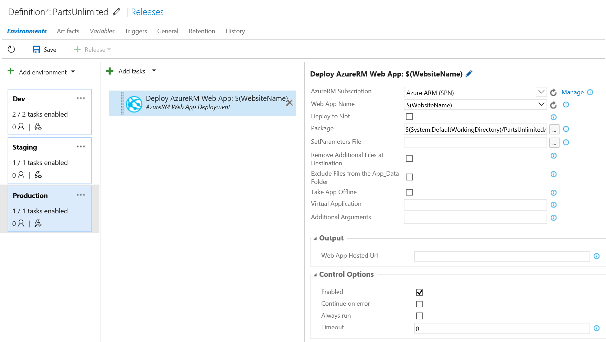
	
### 4: Create a Release
Now that you have configured the Release Pipeline, you are ready to trigger a complete
release.
	
* Click on "+ Release" to create a new Release.
* Select the latest build from the build list and click Create.

	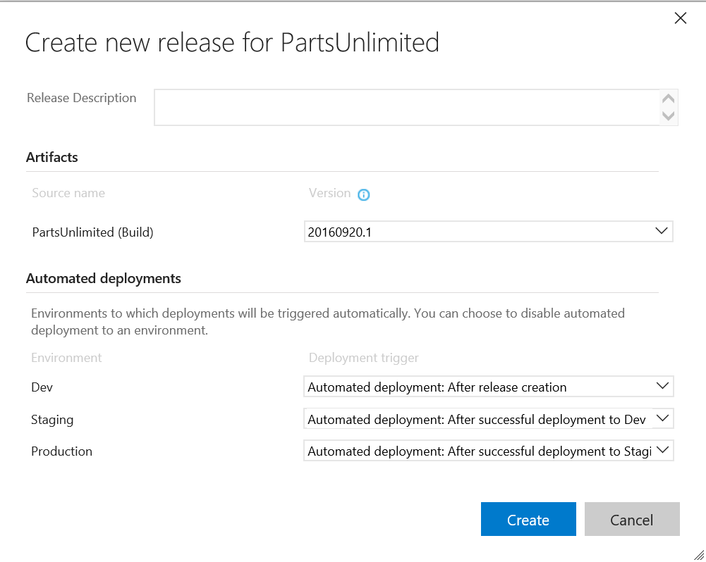
	
* Once the Dev stage has completed deployment, you will see a notification that
an approval is pending (you will also have received an email to this effect).
Check the dev slot of the PartsUnlimited site in Azure to ensure that the Dev
environment is good, and then click Approve.
	
	
* You can also see pending approvals in the overview pane:

	


* Optionally enter a comment and click the Approve button.

	

	* This will trigger the release into the Staging environment.
	> **Note**: You can reassign the approval if required. Also, you may choose to have fewer approval steps to go from one environment to the next. 
* The deployment will immediately pause again - this time for an incoming approval to Staging.
* Approve the incoming deployment for Staging.
* Once the Staging deployment has completed, you will need to approve that
staging is OK.
* This will then trigger the pre-approval for Production. Once you've approved
that, deployment into the Production environment will begin.

> To see all your releases and where they are in their respective pipelines,
click on All Releases and then click the Overview link.


## Congratulations!
You've completed this HOL!

>**Note:** Deployment of schemas and data is beyond the scope of this HOL. It is recommended that you investigate
<a href="https://msdn.microsoft.com/en-us/library/hh272686(v=vs.103).aspx">SQL Server Data Tools (SSDT)</a> for 
managing database schema deployments.

## Further Reading
1. [Release Management for Visual Studio Team Services](https://msdn.microsoft.com/Library/vs/alm/release/overview-rmpreview)
2. [Cloud Load Testing in Visual Studio Team Services](https://channel9.msdn.com/Events/Visual-Studio/Connect-event-2015/Cloud-Loading-Testing-in-Visual-Studio-Team-Service)

The following are other PartsUnlimited Hands on Labs that you can try in your own time. **These are not required for the EdX course!**:

1. [User Telemetry with Application Insights](https://github.com/Microsoft/PartsUnlimited/blob/hands-on-labs/docs/HOL_PartsUnlimited_HDD-User-Telemetry/HOL_PartsUnlimited_HDD-User-Telemetry.md)
2. [Testing in Production with Azure Websites - PartsUnlimited](https://github.com/Microsoft/PartsUnlimited/blob/hands-on-labs/docs/HOL_HDD_Testing_in_Production/HDD%20Testing%20in%20Production%20with%20Azure%20Websites%20HOL.md)
3. [Application Performance Monitoring - PartsUnlimited](https://github.com/Microsoft/PartsUnlimited/blob/hands-on-labs/docs/HOL_PartsUnlimited_Application_Performance_Monitoring/HOL_PartsUnlimited_Application_Performance_Monitoring.md)
